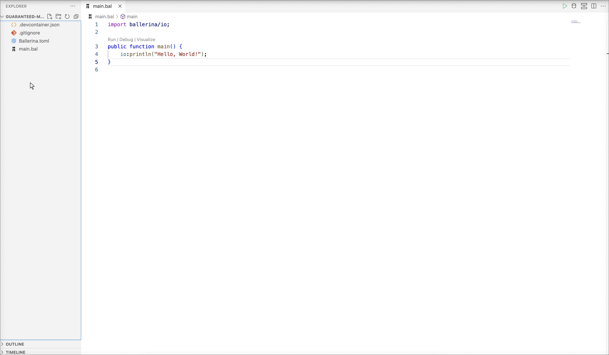
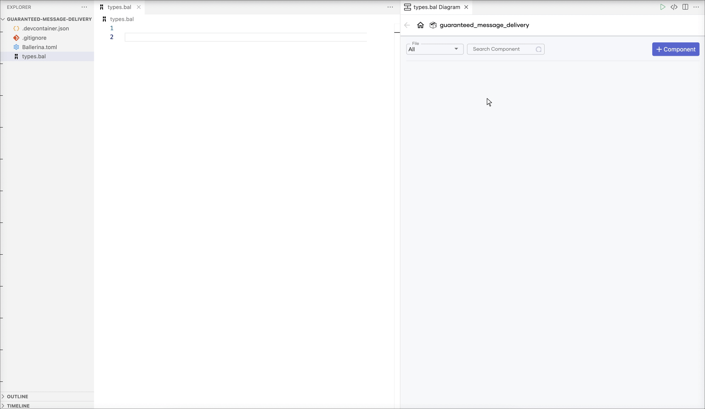
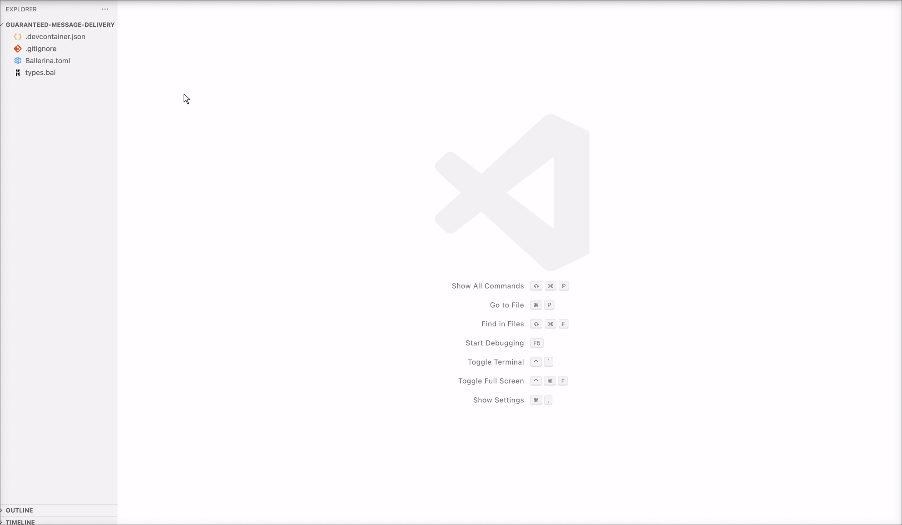
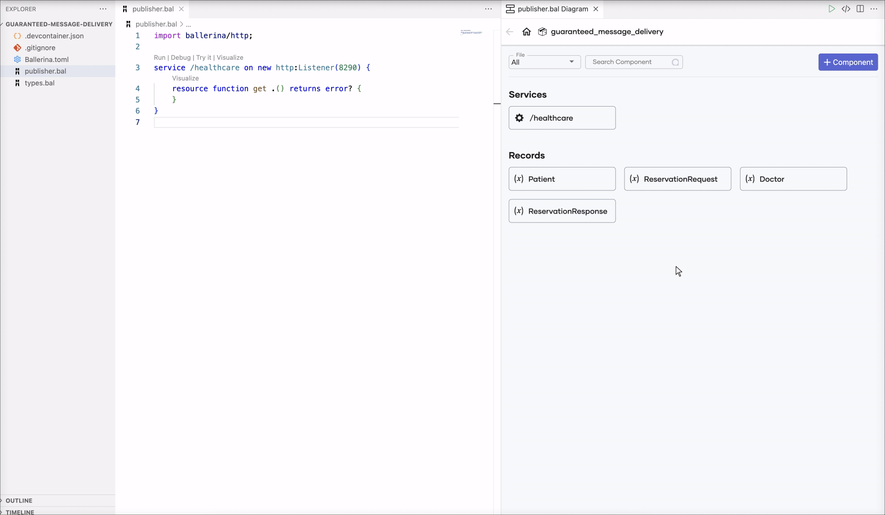
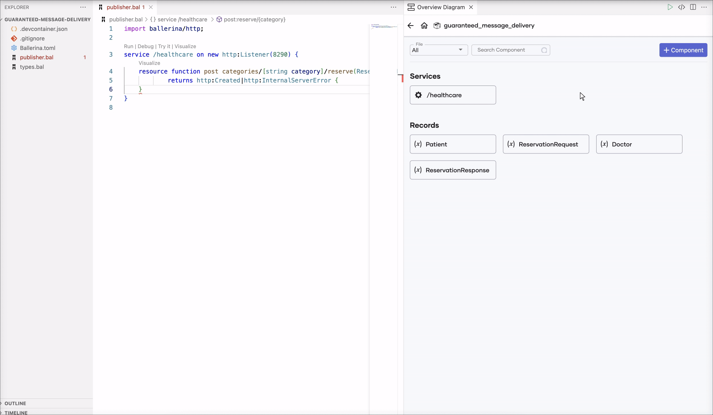
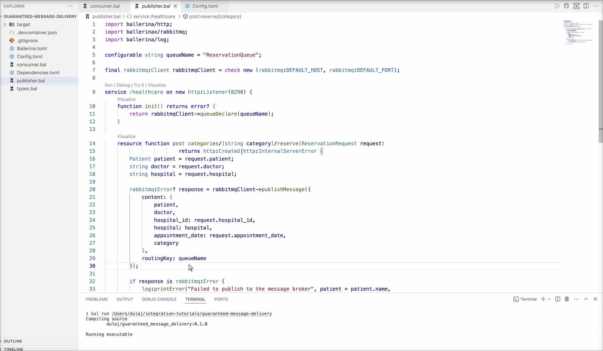

# Guaranteed Message Delivery

## Overview

In this tutorial, you'll create a service that lets users reserve appointments at a hospital. To manage the flow of requests, you'll employ a message broker. One part of your application will send appointment requests to the message broker, and another part will listen to the broker's message queue. When a new request is detected, this listener service will interact with the hospital's backend and SMS service to finalize the reservation.

To implement this use case, you will develop a REST service with a single resource using Visual Studio Code with the Ballerina Swan Lake extension. This resource will handle incoming user requests and forward them to the message broker. A separate service (consumer service) that listens to the message broker's queue for new appointment requests will trigger a backend call to the hospital to make the reservation and send an SMS to the patient's phone number.

The flow is as follows.

1. The publisher service receives a request with a JSON payload in the following form.

    ```json
    {
        "patient": {
            "name": "John Doe",
            "dob": "1940-03-19",
            "ssn": "234-23-525",
            "address": "California",
            "phone": "+94710889877",
            "email": "johndoe@gmail.com"
        },
        "doctor": "thomas collins",
        "hospital_id": "grandoaks",
        "hospital": "grand oak community hospital",
        "appointment_date": "2023-10-02"
    }
    ```

2. The publisher service publishes the receiving payload to the message broker

3. The consumer service acquires the message from the message broker, extracts the necessary details (e.g. patient, doctor, hospital) and makes a call to the hospital backend service to request an appointment. A response similar to the following will be returned from the hospital backend service on success.

    ```json
    {
        "appointmentNumber": 1,
        "doctor": {
            "name": "thomas collins",
            "hospital": "grand oak community hospital",
            "category": "surgery",
            "availability": "9.00 a.m - 11.00 a.m",
            "fee": 7000.0
        },
        "patient": {
            "name": "John Doe",
            "dob": "1940-03-19",
            "ssn": "234-23-525",
            "address": "California",
            "phone": "8770586755",
            "email": "johndoe@gmail.com"
        },
        "hospital": "grand oak community hospital",
        "confirmed": false,
        "appointmentDate": "2023-10-02"
    }
    ```

4. Call the SMS service endpoint to send a message to the patient's mobile number.

### Concepts covered

- REST API
- Message broker
- HTTP Client
- Twilio client

## Develop the application

### Step 1: Set up the workspace

Install [Ballerina Swan Lake](https://ballerina.io/downloads/) and the [Ballerina Swan Lake VS Code extension](https://marketplace.visualstudio.com/items?itemName=wso2.ballerina) on VS Code.

### Step 2: Develop the service

Follow the instructions given in this section to develop the service.

1. Create a new Ballerina project using the `bal` command and open it in VS Code.

    ```
    $ bal new guaranteed-message-delivery
    ```

2. Remove the `main.bal` file and open the diagram view in VS Code.

    

3. Create a file named `types.bal` and generate record types corresponding to the payloads from the hospital backend service by providing samples of the expected JSON payload.

    The payload from the hospital backend service will be a JSON object similar to the following.

    ```json
    {
        "appointmentNumber": 1,
        "doctor": {
            "name": "thomas collins",
            "hospital": "grand oak community hospital",
            "category": "surgery",
            "availability": "9.00 a.m - 11.00 a.m",
            "fee": 7000.0
        },
        "patient": {
            "name": "John Doe",
            "dob": "1940-03-19",
            "ssn": "234-23-525",
            "address": "California",
            "phone": "8770586755",
            "email": "johndoe@gmail.com"
        },
        "hospital": "grand oak community hospital",
        "confirmed": false,
        "appointmentDate": "2023-10-02"
    }
    ```

    

    The generated records will be as follows.

    ```ballerina
    type Patient record {
        string name;
        string dob;
        string ssn;
        string address;
        string phone;
        string email;
    };

    type Doctor record {
        string name;
        string hospital;
        string category;
        string availability;
        decimal fee;
    };

    type ReservationResponse record {
        int appointmentNumber;
        Doctor doctor;
        Patient patient;
        string hospital;
        boolean confirmed;
        string appointmentDate;
    };
    ```

    Similarly, generate records corresponding to the request payload (e.g., `ReservationRequest`). Delete the duplicate `Patient` record generated.

    > **Note:**
    > While it is possible to work with the JSON payload directly, using record types offers several advantages including enhanced type safety, data validation, and better tooling experience (e.g., completion).

    > **Note:** 
    > When the fields of the JSON objects are expected to be exactly those specified in the sample payload, the generated records can be updated to be [closed records](https://ballerina.io/learn/by-example/controlling-openness/), which would indicate that no other fields are allowed or expected.

**Now you are going to implement the application logic in two files: `publisher.bal` and `consumer.bal`**

4. Create a file named `publisher.bal` and define the [HTTP service (REST API)](https://ballerina.io/learn/by-example/#rest-service) that has the resource that accepts user requests and publish to the message broker.

    - Open the [Ballerina HTTP API Designer](https://wso2.com/ballerina/vscode/docs/design-the-services/http-api-designer) in VS Code.

    - Use `/healthcare` as the service path (or the context) for the service attached to the listener that is listening on port `8290`.

        
     
    - Define an HTTP resource that allows the `POST` operation on the resource path `/categories/{category}/reserve` and accepts the `category` path parameter (corresponding to the specialization). Use `ReservationRequest` as a parameter indicating that the resource expects a JSON object corresponding to `ReservationRequest` as the payload. Use `http:Created` and `http:InternalServerError` as the response types.

        

        The generated service will be as follows.

        ```ballerina
        service /healthcare on new http:Listener(8290) {
            resource function post categories/[string category]/reserve(ReservationRequest payload) 
                    returns http:Created|http:InternalServerError {
                
            }
        }
        ```

5. Define a [configurable variable](https://ballerina.io/learn/by-example/#configurability) for the name of the queue.

    

    The generated code will be as follows.

    ```ballerina
    configurable string queueName = "ReservationQueue";
    ```

6. Create a [rabbitmq: Client](https://central.ballerina.io/ballerinax/rabbitmq/latest#Client) object to forward the message to the message broker.
    
    - Use rabbitmq's default host and default port to initialize the client object

    

    The generated code will be as follows.

    ```ballerina
    final rabbitmq:Client rabbitmqClient = check new (rabbitmq:DEFAULT_HOST, rabbitmq:DEFAULT_PORT)
    ```

7. Implement the logic

    ```ballerina
    service /healthcare on new http:Listener(8290) {
        function init() returns error? {
            return rabbitmqClient->queueDeclare(queueName);
        }

        resource function post categories/[string category]/reserve(ReservationRequest request)
                        returns http:Created|http:InternalServerError {
            Patient patient = request.patient;
            string doctor = request.doctor;
            string hospital = request.hospital;

            rabbitmq:Error? response = rabbitmqClient->publishMessage({
                content: {
                    patient,
                    doctor,
                    hospital_id: request.hospital_id,
                    hospital: hospital,
                    appointment_date: request.appointment_date,
                    category
                },
                routingKey: queueName
            });

            if response is rabbitmq:Error {
                log:printError("Failed to publish to the message broker", patient = patient.name,
                                                                        doctor = doctor,
                                                                        hospital = hospital);
                return <http:InternalServerError>{body: response.message()};
            }

            return http:CREATED;
        }
    }
    ```

8. Create a file named `consumer.bal` and define the record types needed for rabbitmq listener

    ```ballerina
    type MessageContent record {|
        *ReservationRequest;
        string category;
    |};

    type RabbitMqMessage record {|
        *rabbitmq:AnydataMessage;
        MessageContent content;
    |};
    ```

    > **Note:**
    > Using [record type inclusion](https://ballerina.io/learn/by-example/type-inclusion-for-records/) allows including all the fields from the included record along with the defined fields.

9. Define configurations for the SMS service endpoints (e.g. `fromNumber`, `accountSId`, `authToken`) as [configurable variables](https://ballerina.io/learn/by-example/#configurability)

    ```ballerina
    configurable string fromNumber = ?;
    configurable string accountSId = ?;
    configurable string authToken = ?;
    ```

10. Implement the consumer service.

    ```ballerina
    @rabbitmq:ServiceConfig {
        queueName
    }
    service rabbitmq:Service on new rabbitmq:Listener(rabbitmq:DEFAULT_HOST, rabbitmq:DEFAULT_PORT) {
        remote function onMessage(RabbitMqMessage message) {
            MessageContent content = message.content;
            string hospital = content.hospital;
            string patientName = content.patient.name;
            string doctor = content.doctor;

            ReservationResponse|http:ClientError reservationResponse = 
                hospitalBackend->/[content.hospital_id]/categories/[content.category]/reserve.post({
                    patient: content.patient,
                    doctor,
                    hospital,
                    appointment_date: content.appointment_date
                });

            string smsBody;
            if reservationResponse is http:ClientError {
                log:printError("Reservation request failed", patient = patientName,
                                                            doctor = doctor,
                                                            hospital = hospital);
                smsBody = string `Dear ${patientName
                            }, your appointment request at ${hospital
                            } failed. Please try again.`;
            } else {
                smsBody = string `Dear ${patientName
                            }, your appointment has been accepted at ${hospital
                            }. Appointment No: ${reservationResponse.appointmentNumber}`;
            }

            twilio:SmsResponse|error smsApiStatus = twilioEp->sendSms(fromNumber, content.patient.phone, smsBody);

            if smsApiStatus !is twilio:SmsResponse {
                log:printError("Failed to send an SMS message", smsApiStatus, phoneNo = content.patient.phone);
            }
        }
    }
    ```

    -  Create the `rabbitmq:Service` listening on `rabbitmq:Listener` and remote function named `onMessage` which takes a message as an argument.

    - Extract the necessary values to variables and send a `POST` request to the hospital service to reserve the appointment. The `hospital_id` and `category` values are ued as path parameters

    - Use the `is` check to decide the flow based on the response to the client call. If the request failed with an error, log the error and set the `smsBody` an error message, else, set is as a confirmation message.

    - Call the twilio endpoint with configurations (e.g. from number, patient's phone number) and SMS body

    - Log an error if the calling twilio endpoint fails.

#### Complete source

<TODO: Complete source code>

### Step 3: Build and run the service


> **Note:**
> Alternatively, you can run this service by navigating to the project root and using the `bal run` command.
>
> ```
> guaranteed-message-delivery$ bal run
> Compiling source
>         integration_tutorials/guaranteed-message-delivery:0.1.0
>
> Running executable
> ```

### Step 4: Try out the use case

Let's test the use case by sending a request to the service.

#### Start the backend service

Download the JAR file for the [backend service](https://github.com/ballerina-guides/integration-tutorials/blob/main/backends/hospital-service/hospitalservice.jar) and execute the following command to start the service.

```
$ bal run hospitalservice.jar
```

#### Start the rabbitmq message broker

Follow the [rabbitmq guidelines ](<link to the guidelines>) to configure and start the rabbitmq message broker.

#### Send a request

Use the [Try it](https://wso2.com/ballerina/vscode/docs/try-the-services/try-http-services/) feature to send a request to the service. Specify `surgery` as the path parameter. Use the following as the request payload.

```json
    {
        "patient": {
            "name": "John Doe",
            "dob": "1940-03-19",
            "ssn": "234-23-525",
            "address": "California",
            "phone": "+9470586755",
            "email": "johndoe@gmail.com",
        },
        "doctor": "thomas collins",
        "hospital_id": "grandoaks",
        "hospital": "grand oak community hospital",
        "appointment_date": "2023-10-02"
    }
```



#### Verify the SMS

You will receive an SMS with information similar to the following for a successful appointment reservation.

```
Dear John Doe, your appointment has been accepted at grand oak community hospital. Appointment No: 1
```

## References

- [`ballerina/http` API docs](https://lib.ballerina.io/ballerina/http/latest)
- [`ballerina/log` API docs](https://lib.ballerina.io/ballerina/log/latest)
- [`ballerinax/twilio` API docs](https://central.ballerina.io/ballerinax/twilio/latest)
- [`RabbitMQ` API docs](https://central.ballerina.io/ballerinax/rabbitmq/latest)