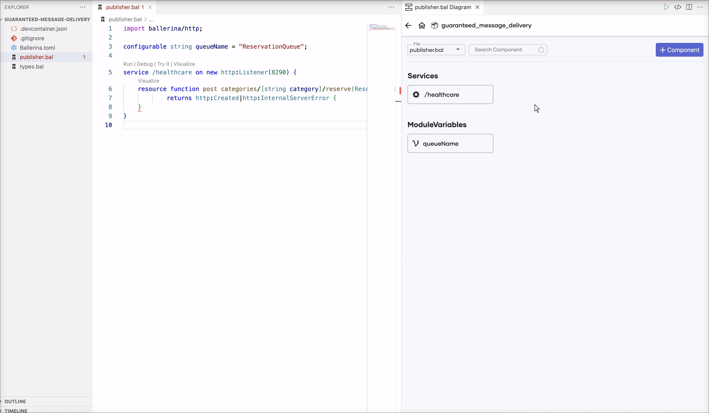
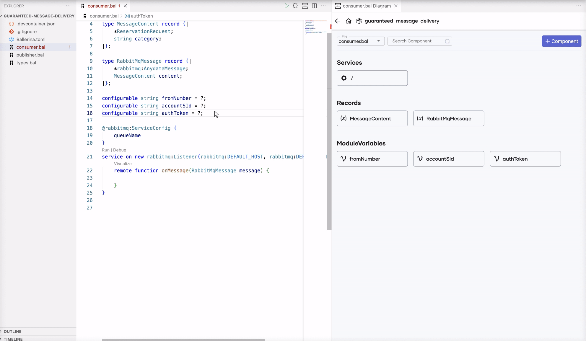
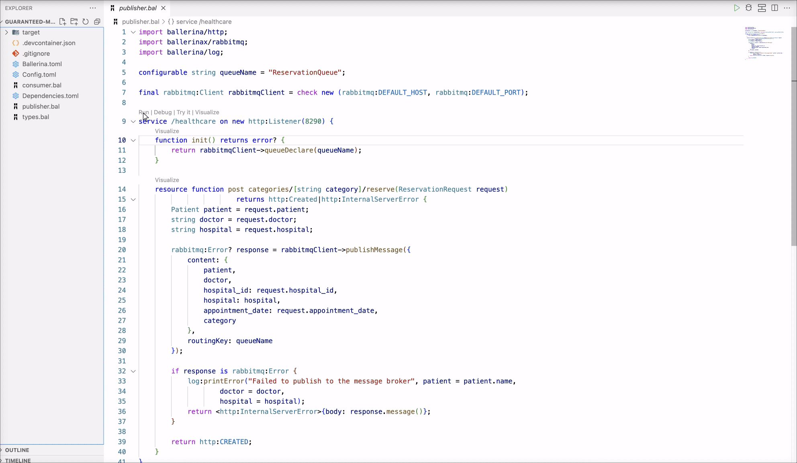

# Guaranteed Message Delivery

## Overview

In this tutorial, you will develop an integration that lets users reserve appointments at a hospital. To manage the guranteed flow of reservation requests, you will employ a message broker. A publisher service will accept the appointment requests from users and publish to a message broker. A consumer service will consume messages from the message broker and interact with the hospital service to complete the reservation and send an SMS with the reservation status.

To implement this use case, you will develop a REST service with a single resource using Visual Studio Code with the Ballerina Swan Lake extension. This resource will handle incoming user requests and forward them to the message broker. The consumer service that listens to a queue of the message broker will trigger a backend call to the hospital to make the reservation and send an SMS to the patient's phone number informing the reservation status.

The flow is as follows.

1. The publisher service receives a request with a JSON payload in the following form.

    ```json
    {
        "patient": {
            "name": "John Doe",
            "dob": "1940-03-19",
            "ssn": "234-23-525",
            "address": "California",
            "phone": "+94710889877",
            "email": "johndoe@gmail.com"
        },
        "doctor": "thomas collins",
        "hospital_id": "grandoaks",
        "hospital": "grand oak community hospital",
        "appointment_date": "2023-10-02"
    }
    ```

2. The publisher service publishes the received payload to the message broker.

3. The consumer service consumes the message from the message broker, extracts the necessary details (e.g., patient, doctor, and hospital details) and makes a call to the hospital backend service to request an appointment. A response similar to the following will be returned from the hospital backend service on success.

    ```json
    {
        "appointmentNumber": 1,
        "doctor": {
            "name": "thomas collins",
            "hospital": "grand oak community hospital",
            "category": "surgery",
            "availability": "9.00 a.m - 11.00 a.m",
            "fee": 7000.0
        },
        "patient": {
            "name": "John Doe",
            "dob": "1940-03-19",
            "ssn": "234-23-525",
            "address": "California",
            "phone": "8770586755",
            "email": "johndoe@gmail.com"
        },
        "hospital": "grand oak community hospital",
        "confirmed": false,
        "appointmentDate": "2023-10-02"
    }
    ```

4. The consumer service will then send an SMS to the patient's mobile number notifying the reservation status.

### Concepts covered

- REST API
- Message Broker
- HTTP Client
- Twilio Client

## Develop the application

### Step 1: Set up the workspace

Install [Ballerina Swan Lake](https://ballerina.io/downloads/) and the [Ballerina Swan Lake VS Code extension](https://marketplace.visualstudio.com/items?itemName=wso2.ballerina) on VS Code.

### Step 2: Develop the service

Follow the instructions given in this section to develop the service.

1. Create a new Ballerina project using the `bal` command and open it in VS Code.

    ```
    $ bal new guaranteed-message-delivery
    ```

2. Rename the `main.bal` file to `types.bal`, remove the generated content, and open the diagram view in VS Code.

    

3. Generate record types corresponding to the request payload by providing samples of the expected JSON payload.

    The request payload expected by the service will be a JSON object similar to the following.

    ```json
    {
        "patient": {
            "name": "John Doe",
            "dob": "1940-03-19",
            "ssn": "234-23-525",
            "address": "California",
            "phone": "+94710889877",
            "email": "johndoe@gmail.com"
        },
        "doctor": "thomas collins",
        "hospital_id": "grandoaks",
        "hospital": "grand oak community hospital",
        "appointment_date": "2023-10-02"
    }
    ```

    

    The generated records will be as follows.

    ```ballerina
    type Patient record {
        string name;
        string dob;
        string ssn;
        string address;
        string phone;
        string email;
    };

    type ReservationRequest record {
        Patient patient;
        string doctor;
        string hospital_id;
        string hospital;
        string appointment_date;
    };
    ```

    Similarly, generate records corresponding to the response payload from the hospital backend service (e.g., `ReservationResponse`). Delete the duplicate `Patient` record generated.

    ```ballerina
    type Doctor record {
        string name;
        string hospital;
        string category;
        string availability;
        decimal fee;
    };

    type ReservationResponse record {
        int appointmentNumber;
        Doctor doctor;
        Patient patient;
        string hospital;
        boolean confirmed;
        string appointmentDate;
    };
    ```

    > **Note:**
    > While it is possible to work with the JSON payload directly, using record types offers several advantages including enhanced type safety, data validation, and better tooling experience (e.g., completion).

    > **Note:** 
    > When the fields of the JSON objects are expected to be exactly those specified in the sample payload, the generated records can be updated to be [closed records](https://ballerina.io/learn/by-example/controlling-openness/), which would indicate that no other fields are allowed or expected.

**Now you are going to implement the publisher and consumer logic in two files: `publisher.bal` and `consumer.bal`**

4. Create a file named `publisher.bal` and define the [HTTP service (REST API)](https://ballerina.io/learn/by-example/#rest-service) that has the resource that accepts user requests and publishes the payload to the message broker.

    - Open the [Ballerina HTTP API Designer](https://wso2.com/ballerina/vscode/docs/design-the-services/http-api-designer) in VS Code.

    - Use `/healthcare` as the service path (or the context) for the service attached to the listener that is listening on port `8290`.

        
     
    - Define an HTTP resource that allows the `POST` operation on the resource path `/categories/{category}/reserve` and accepts the `category` path parameter (corresponding to the specialization). Use `ReservationRequest` as a parameter indicating that the resource expects a JSON object corresponding to `ReservationRequest` as the payload. Use `http:Created` and `http:InternalServerError` as the response types.

        

        The generated service will be as follows.

        ```ballerina
        service /healthcare on new http:Listener(8290) {
            resource function post categories/[string category]/reserve(ReservationRequest request) 
                    returns http:Created|http:InternalServerError {
                
            }
        }
        ```

5. Define a [configurable variable](https://ballerina.io/learn/by-example/#configurability) for the name of the queue.

    

    The generated code will be as follows.

    ```ballerina
    configurable string queueName = "ReservationQueue";
    ```

6. Create a [rabbitmq:Client](https://central.ballerina.io/ballerinax/rabbitmq/latest#Client) object to publish message to the message broker.
    
    - Use the relevant host and port values to initialize the client object. For now, use RabbitMQ's default host and port values.

    

    The generated code will be as follows.

    ```ballerina
    final rabbitmq:Client rabbitmqClient = check new (rabbitmq:DEFAULT_HOST, rabbitmq:DEFAULT_PORT)
    ```

7. Implement the logic.

    ```ballerina
    service /healthcare on new http:Listener(8290) {
        function init() returns error? {
            return rabbitmqClient->queueDeclare(queueName);
        }

        resource function post categories/[string category]/reserve(ReservationRequest request)
                        returns http:Created|http:InternalServerError {
            Patient patient = request.patient;
            string doctor = request.doctor;
            string hospital = request.hospital;

            rabbitmq:Error? response = rabbitmqClient->publishMessage({
                content: {
                    patient,
                    doctor,
                    hospital_id: request.hospital_id,
                    hospital: hospital,
                    appointment_date: request.appointment_date,
                    category
                },
                routingKey: queueName
            });

            if response is rabbitmq:Error {
                log:printError("Failed to publish to the message broker", patient = patient.name,
                                                                        doctor = doctor,
                                                                        hospital = hospital);
                return <http:InternalServerError>{body: response.message()};
            }

            return http:CREATED;
        }
    }
    ```

    - Define the `init` method and declare the queue on the message broker using the `queueDeclare` method on service initialization.

    - In the resource method, first, define three variables (i.e., `patient`, `doctor` and `hospital`) and assign to them values from the `request` record.

    - Call the `publishMessage` method on the `rabbitmqClient` value to publish the message to the RabbitMQ message broker.

    - Use the `is` check to check if publishing failed. Return an `http:InternalServerError` response on error (i. e., failure), else, return an `http:CREATED` response.


8. Create a file named `consumer.bal` and first define the consumer-specific record types.

    ```ballerina
    type MessageContent record {|
        *ReservationRequest;
        string category;
    |};

    type RabbitMqMessage record {|
        *rabbitmq:AnydataMessage;
        MessageContent content;
    |};
    ```

    > **Note:**
    > Using [record type inclusion](https://ballerina.io/learn/by-example/type-inclusion-for-records/) allows including all the fields from the included record along with the defined fields.

    > **Note:**
    > Since details in the reservation and the `rabbitmq:AnydataMessage` needed to be merged, a separate record (i.e. `RabbitMqMessage`) is created.

9. Define a RabbitMQ service listening on a `rabbitmq:Listener` listener with the `onMessage` remote method that gets called when a messaged is published to the specified queue on the message broker.

    ```ballerina
    @rabbitmq:ServiceConfig {
        queueName
    }
    service on new rabbitmq:Listener(rabbitmq:DEFAULT_HOST, rabbitmq:DEFAULT_PORT) {
        remote function onMessage(RabbitMqMessage message) {
            
        }
    }
    ```


9. Define [configurable variables](https://ballerina.io/learn/by-example/#configurability) (e.g., `fromNumber`, `accountSId`, `authToken`) for the SMS service endpoints.

    ```ballerina
    configurable string fromNumber = ?;
    configurable string accountSId = ?;
    configurable string authToken = ?;
    ```

10. Define an [`http:Client`](https://ballerina.io/learn/by-example/#http-client) object to send requests to the hospital backend service and a [`twilio:Client`](https://central.ballerina.io/ballerinax/twilio/latest#Client) object to send SMS messages to the given phone number via Twilio.

    

    The generated code will be as follows.

    ```ballerina
    final http:Client hospitalBackend = check new (url = "http://localhost:9090");
    final twilio:Client twilioEp = check new (config = {
        auth: {
            username: accountSId,
            password: authToken
        }
    });
    ```

10. Implement the logic.

    ```ballerina
    @rabbitmq:ServiceConfig {
        queueName
    }
    service on new rabbitmq:Listener(rabbitmq:DEFAULT_HOST, rabbitmq:DEFAULT_PORT) {
        remote function onMessage(RabbitMqMessage message) {
            MessageContent content = message.content;
            string hospital = content.hospital;
            string patientName = content.patient.name;
            string doctor = content.doctor;

            ReservationResponse|http:ClientError reservationResponse = 
                hospitalBackend->/[content.hospital_id]/categories/[content.category]/reserve.post({
                    patient: content.patient,
                    doctor,
                    hospital,
                    appointment_date: content.appointment_date
                });

            string smsBody;
            if reservationResponse is http:ClientError {
                log:printError("Reservation request failed", patient = patientName,
                                                            doctor = doctor,
                                                            hospital = hospital);
                smsBody = string `Dear ${patientName
                            }, your appointment request at ${hospital
                            } failed. Please try again.`;
            } else {
                smsBody = string `Dear ${patientName
                            }, your appointment has been accepted at ${hospital
                            }. Appointment No: ${reservationResponse.appointmentNumber}`;
            }

            twilio:Message|error smsApiResponse = twilioEp->createMessage({
                To: content.patient.phone,
                From: fromNumber,
                Body: smsBody
            });

            if smsApiResponse is error {
                log:printError("Failed to send an SMS message", smsApiResponse, phoneNo = content.patient.phone);
            }
        }
    }
    ```

    - Extract the necessary values to variables and send a `POST` request to the hospital service to reserve the appointment. The `hospital_id` and `category` values are used as path parameters.

    - Use the `is` check to decide the flow based on the response to the client call. If the request failed with an error, log the error and set an error message to the `smsBody` variable, else, set a confirmation message.

    - Call the Twilio endpoint with the SMS body and the sender's and patient's phone numbers.

#### Complete source

```ballerina
// types.bal

type Patient record {|
    string name;
    string dob;
    string ssn;
    string address;
    string phone;
    string email;
|};

type ReservationRequest record {|
    Patient patient;
    string doctor;
    string hospital_id;
    string hospital;
    string appointment_date;
|};

type Doctor record {|
    string name;
    string hospital;
    string category;
    string availability;
    decimal fee;
|};

type ReservationResponse record {|
    int appointmentNumber;
    Doctor doctor;
    Patient patient;
    string hospital;
    boolean confirmed;
    string appointmentDate;
|};
```

```ballerina
// publisher.bal

import ballerina/http;
import ballerina/log;
import ballerinax/rabbitmq;

configurable string queueName = "ReservationQueue";

final rabbitmq:Client rabbitmqClient = check initializeRabbitMqClient();

function initializeRabbitMqClient() returns rabbitmq:Client|error => new (rabbitmq:DEFAULT_HOST, rabbitmq:DEFAULT_PORT);

service /healthcare on new http:Listener(8290) {
    function init() returns error? {
        return rabbitmqClient->queueDeclare(queueName);
    }

    resource function post categories/[string category]/reserve(ReservationRequest request)
                    returns http:Created|http:InternalServerError {
        Patient patient = request.patient;
        string doctor = request.doctor;
        string hospital = request.hospital;

        rabbitmq:Error? response = rabbitmqClient->publishMessage({
            content: {
                patient,
                doctor,
                hospital_id: request.hospital_id,
                hospital: hospital,
                appointment_date: request.appointment_date,
                category
            },
            routingKey: queueName
        });

        if response is rabbitmq:Error {
            log:printError("Failed to publish to the message broker", patient = patient.name,
                                                                      doctor = doctor,
                                                                      hospital = hospital);
            return <http:InternalServerError>{body: response.message()};
        }

        return http:CREATED;
    }
}
```

```ballerina
// consumer.bal

import ballerina/http;
import ballerina/log;
import ballerinax/rabbitmq;
import ballerinax/twilio;

type MessageContent record {|
    *ReservationRequest;
    string category;
|};

type RabbitMqMessage record {|
    *rabbitmq:AnydataMessage;
    MessageContent content;
|};

configurable string fromNumber = ?;
configurable string accountSId = ?;
configurable string authToken = ?;

final http:Client hospitalBackend = check initializeHttpClient();

final twilio:Client twilioEp = check initializeTwilioClient();

function initializeHttpClient() returns http:Client|error => new ("http://localhost:9090");

function initializeTwilioClient() returns twilio:Client|error => new ({
    auth: {
        username: accountSId,
        password: authToken
    }
});

@rabbitmq:ServiceConfig {
    queueName
}
service on new rabbitmq:Listener(rabbitmq:DEFAULT_HOST, rabbitmq:DEFAULT_PORT) {
    remote function onMessage(RabbitMqMessage message) {
        MessageContent content = message.content;
        string hospital = content.hospital;
        string patientName = content.patient.name;
        string doctor = content.doctor;

        ReservationResponse|http:ClientError reservationResponse = 
            hospitalBackend->/[content.hospital_id]/categories/[content.category]/reserve.post({
                patient: content.patient,
                doctor,
                hospital,
                appointment_date: content.appointment_date
            });

        string smsBody;
        if reservationResponse is http:ClientError {
            log:printError("Reservation request failed", patient = patientName,
                                                         doctor = doctor,
                                                         hospital = hospital);
            smsBody = string `Dear ${patientName
                        }, your appointment request at ${hospital
                        } failed. Please try again.`;
        } else {
            smsBody = string `Dear ${patientName
                        }, your appointment has been accepted at ${hospital
                        }. Appointment No: ${reservationResponse.appointmentNumber}`;
        }

        twilio:Message|error smsApiResponse = twilioEp->createMessage({
            To: content.patient.phone,
            From: fromNumber,
            Body: smsBody
        });

        if smsApiResponse is error {
            log:printError("Failed to send an SMS message", smsApiResponse, phoneNo = content.patient.phone);
        }
    }
}
```

### Step 3: Build and run the Ballerina project

#### Start the RabbitMQ message broker

Follow the [RabbitMQ guidelines](https://www.rabbitmq.com/tutorials) to configure and start the RabbitMQ message broker.

#### Run the project

Define the configurable values in the `Config.bal` file and run the Ballerina program.



> **Note:**
> Alternatively, you can run this project by navigating to the project root and using the `bal run` command.
>
> ```
> guaranteed-message-delivery$ bal run
> Compiling source
>         integration_tutorials/guaranteed-message-delivery:0.1.0
>
> Running executable
> ```

### Step 4: Try out the use case

Let's test the use case by sending a request to the service.

#### Start the backend service

Download the JAR file for the [backend service](https://github.com/ballerina-guides/integration-tutorials/blob/main/backends/hospital-service/hospitalservice.jar) and execute the following command to start the service.

```
$ bal run hospitalservice.jar
```

#### Send a request

Use the [Try it](https://wso2.com/ballerina/vscode/docs/try-the-services/try-http-services/) feature to send a request to the service. Specify `surgery` as the path parameter. Use the following as the request payload.

```json
    {
        "patient": {
            "name": "John Doe",
            "dob": "1940-03-19",
            "ssn": "234-23-525",
            "address": "California",
            "phone": "+94710889867",
            "email": "johndoe@gmail.com"
        },
        "doctor": "thomas collins",
        "hospital_id": "grandoaks",
        "hospital": "grand oak community hospital",
        "appointment_date": "2023-10-02"
    }
```


#### Verify the SMS

You will receive an SMS with information similar to the following for a successful reservation.

```
Dear John Doe, your appointment has been accepted at grand oak community hospital. Appointment No: 1
```

## References

- [`ballerina/http` API docs](https://lib.ballerina.io/ballerina/http/latest)
- [`ballerina/log` API docs](https://lib.ballerina.io/ballerina/log/latest)
- [`ballerinax/twilio` API docs](https://central.ballerina.io/ballerinax/twilio/latest)
- [`RabbitMQ` API docs](https://central.ballerina.io/ballerinax/rabbitmq/latest)