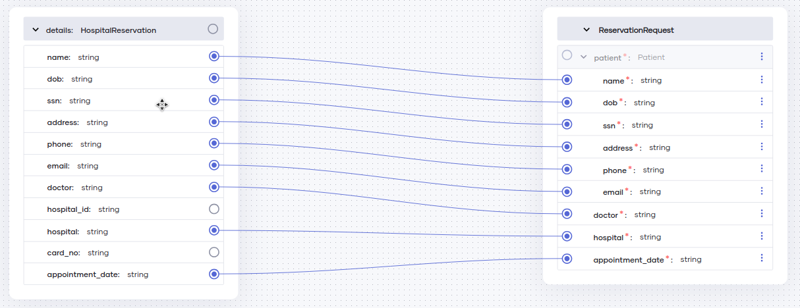
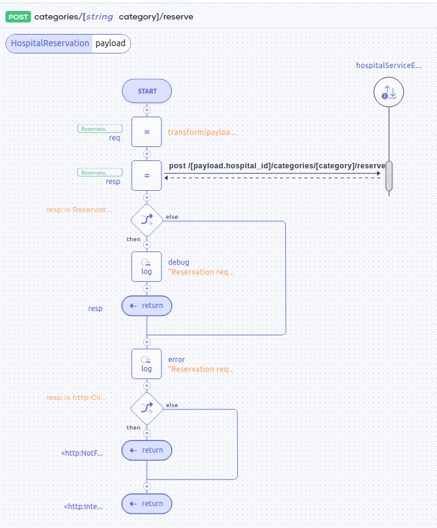

# Transform message formats

## Overview

In this tutorial, you will develop an appointment reservation service. The requests are transformed from one format to another and forwarded to the backend hospital service.

To implement this use case, you will develop a REST service with a single resource using Visual Studio Code with Ballerina Swan Lake extension. The resource will receive the user request, transform the request format into another format, send a request to the hospital service, and respond with the correct reservation details.

The flow is as follows

1. Receive a request with a JSON payload similar to the following.
```json
{
    "name": "John Doe",
    "dob": "1940-03-19",
    "ssn": "234-23-525",
    "address": "California",
    "phone": "8770586755",
    "email": "johndoe@gmail.com",
    "doctor": "thomas collins",
    "hospital_id": "grandoaks",
    "hospital": "grand oak community hospital",
    "card_no": "7844481124110331",
    "appointment_date": "2017-04-02"
}
```
2. Transform the request data into a form that is similar to the following.

```json
{
    "patient": {
        "name": "John Doe",
        "dob": "1940-03-19",
        "ssn": "234-23-525",
        "address": "California",
        "phone": "8770586755",
        "email": "johndoe@gmail.com",
        "card_no": "7844481124110331"
    },
    "doctor": "thomas collins",
    "hospital": "grand oak community hospital",
    "appointment_date": "2017-04-02"
}
```

3. Extract `hospital_id` field to construct the URL of the post request to the hospital service.

4. Retrieve the reservation response by calling the hospital service with the transformed request and `hospital_id`. The response will be similar to the following. 

```json
{
    "appointmentNumber": 8,
    "doctor": {
        "name": "thomas collins",
        "hospital": "grand oak community hospital",
        "category": "surgery",
        "availability": "9.00 a.m - 11.00 a.m",
        "fee": 7000.0
    },
    "patient": {
        "name": "John Doe",
        "dob": "1940-03-19",
        "ssn": "234-23-525",
        "address": "California",
        "phone": "8770586755",
        "email": "johndoe@gmail.com"
    },
    "fee": 7000.0,
    "hospital": "grand oak community hospital",
    "confirmed": false,
    "appointmentDate": "2017-04-02"
}
```

### Concepts covered

- REST API
- HTTP client
- Data Mapper

## Develop the application

### Step 1: Set up the workspace

Install [Ballerina Swan Lake](https://ballerina.io/downloads/) and the [Ballerina Swan Lake VS Code extension](https://marketplace.visualstudio.com/items?itemName=wso2.ballerina) on VS Code.

### Step 2: Develop the service

Follow the instructions given in this section to develop the service.

1. Create a new Ballerina project using the `bal` command and open it in VS Code.

```bash
$ bal new transform-message-formats
```

2. Introduce the source code in files with the `.bal` extension (e.g., the `main.bal` file).

Import the
- `ballerina/http` module to develop the REST API and define the clients that can be used to send requests to the backend services
- `ballerina/log` module to log debug, error, or info level information for each client request

```ballerina
import ballerina/http;
import ballerina/log;
```

3. Define two [configurable variables](https://ballerina.io/learn/by-example/#configurability) for the port on which the listener should listen and the URL of the hospital service.

```ballerina
configurable int port = 8290;
configurable string hospitalServiceUrl = "http://localhost:9090";
```

4. Define an [`http:Client`](https://ballerina.io/learn/by-example/#http-client) client to send requests to the backend hospital services.

```ballerina
final http:Client hospitalServiceEP = check initializeHttpClient();

function initializeHttpClient() returns http:Client|error => new (hospitalServiceUrl);
```

> **Note** The argument passed to the `new` expression (`hospitalServiceUrl`) is the URL of the backend hospital service.
> 
> Here, a separate function is used to initialize the clients to aid with testing. Alternatively, the `new` expression can be used directly to initialize the clients.
>
> ```ballerina
> final http:Client hospitalServiceEP = new (hospitalServiceUrl);
>```

5. Define records corresponding to the request payload and response payloads.

```ballerina
type Patient record {|
    string name;
    string dob;
    string ssn;
    string address;
    string phone;
    string email;
|};

type RequestData record {|
    *Patient;
    string doctor;
    string hospital_id;
    string hospital;
    string card_no;
    string appointment_date;
|};

type ReservationRequest record {|
    Patient patient;
    string doctor;
    string hospital;
    string appointment_date;
|};

type Doctor record {|
    string name;
    string hospital;
    string category;
    string availability;
    float fee;
|};

type ReservationResponse record {|
    int appointmentNumber;
    Doctor doctor;
    Patient patient;
    float fee;
    string hospital;
    boolean confirmed;
    string appointmentDate;
|};
```

- `RequestData` is the type of the data the resource takes as the payload.
- `ReservationRequest` is the type of the data that will be sent to the hospital service.
- `ReservationResponse` is the type of the response received from the hospital service.

6. Use data-mapper to define the function which transform the payload from `RequestData` to `ReservationRequest`. 

    Follow the guide shown below to create the `transform` function.

    

    The data mapper diagram of the `transform` function is shown below.

    

    The `transform` function will finally look like this:

    ```ballerina
    isolated function transform(RequestData details) returns ReservationRequest => {
        patient: {
            name: details.name,
            dob: details.dob,
            ssn: details.ssn,
            address: details.address,
            phone: details.phone,
            email: details.email
        },
        doctor: details.doctor,
        hospital: details.hospital,
        appointment_date: details.appointment_date
    };
    ```

7. Define the [HTTP service (REST API)](https://ballerina.io/learn/by-example/#rest-service) that has the resource that accepts user requests, makes a call to the backend hospital service, retrieves reservation details, and responds to the client.

- Use `/healthcare` as the service path (or the context) of the service which is attached to the listener listening on port `port`. 

- The HTTP resource allows the `POST` operation on resource path `/categories/{category}/reserve`, where `category` (corresponding to the specialization) is a path parameter.

- Use `RequestData` as a parameter indicating that the resource expects a JSON object corresponding to `RequestData` as the payload. 

- Use `ReservationResponse|http:NotFound|http:BadRequest|http:InternalServerError` as the return type to indicate that the response will have a JSON payload corresponding to `ReservationResponse` on success or the response will be a "NotFound", "BadRequest" or "InternalServerError" response on error.

```ballerina
service /healthcare on new http:Listener(port) {
    isolated resource function post categories/[string category]/reserve(RequestData payload) 
            returns ReservationResponse|http:NotFound|http:BadRequest|http:InternalServerError {
        
   }
}
```

8. Implement the logic.

```ballerina
service /healthcare on new http:Listener(port) {
    isolated resource function post categories/[string category]/reserve(RequestData payload) 
            returns ReservationResponse|http:NotFound|http:BadRequest|http:InternalServerError {
        ReservationRequest req = transform(payload);
        string hospitalId = payload.hospital_id;
        ReservationResponse|http:ClientError resp =
                    hospitalServiceEP->/[hospitalId]/categories/[category]/reserve.post(req);

        if resp is ReservationResponse {
            log:printDebug("Reservation request successful",
                            name = payload.name,
                            appointmentNumber = resp.appointmentNumber);
            return resp;
        }

        log:printError("Reservation request failed", resp);
        if resp is http:ClientRequestError {
            return <http:NotFound> {body: "Unknown hospital, doctor or category"};
        }

        return <http:InternalServerError> {body: resp.message()};
    }
}
```

- Use the `transform` function to transform the data from `RequestData` to `ReservationRequest`.

    ```ballerina
    ReservationRequest req = transform(payload);
    ```

- Extract `hospital_id` from the payload and use it to construct the URL of the post request.

    ```ballerina
    string hospitalId = payload.hospital_id;
    ```

- Send the transformed payload to the hospital service and get the response. Here, The `hospital_id` and `category` values are used as path parameters.

    ```ballerina
    ReservationResponse|http:ClientError resp = hospitalServiceEP->/[hospitalId]/categories/[category]/reserve.post(req);
    ```

- The `log` functions are used to [log](https://ballerina.io/learn/by-example/#log) information at `INFO`, `DEBUG`, and `ERROR` log levels.

- Use the `is` check to decide the response based on the response to the client call. If the client call was successful and the response is in the type of `ReservationResponse`, then, directly return it. If the request failed, log information at `ERROR` level and send a "NotFound" response if the client call failed with a 4xx status code or return an "InternalServerError" response for other failures.

    ```ballerina
    if resp is ReservationResponse {
        log:printDebug("Reservation request successful",
                        name = payload.name,
                        appointmentNumber = resp.appointmentNumber);
        return resp;
    }

    log:printError("Reservation request failed", resp);
    if resp is http:ClientRequestError {
        return <http:NotFound> {body: "Unknown hospital, doctor or category"};
    }

    return <http:InternalServerError> {body: resp.message()};
    ```

#### Complete source code

You have successfully developed the required service.

```ballerina
import ballerina/http;
import ballerina/log;

configurable int port = 8290;
configurable string hospitalServiceUrl = "http://localhost:9090";

final http:Client hospitalServiceEP = check initializeHttpClient();

function initializeHttpClient() returns http:Client|error => new (hospitalServiceUrl);

type Patient record {|
    string name;
    string dob;
    string ssn;
    string address;
    string phone;
    string email;
|};

type RequestData record {|
    *Patient;
    string doctor;
    string hospital_id;
    string hospital;
    string card_no;
    string appointment_date;
|};

type ReservationRequest record {|
    Patient patient;
    string doctor;
    string hospital;
    string appointment_date;
|};

type Doctor record {|
    string name;
    string hospital;
    string category;
    string availability;
    float fee;
|};

type ReservationResponse record {|
    int appointmentNumber;
    Doctor doctor;
    Patient patient;
    float fee;
    string hospital;
    boolean confirmed;
    string appointmentDate;
|};

service /healthcare on new http:Listener(port) {
    isolated resource function post categories/[string category]/reserve(
            RequestData payload
        ) returns ReservationResponse|http:NotFound|http:BadRequest|http:InternalServerError {
        ReservationRequest req = transform(payload);
        string hospitalId = payload.hospital_id;
        ReservationResponse|http:ClientError resp =
                    hospitalServiceEP->/[hospitalId]/categories/[category]/reserve.post(req);

        if resp is ReservationResponse {
            log:printDebug("Reservation request successful",
                            name = payload.name,
                            appointmentNumber = resp.appointmentNumber);
            return resp;
        }

        log:printError("Reservation request failed", resp);
        if resp is http:ClientRequestError {
            return <http:NotFound> {body: "Unknown hospital, doctor or category"};
        }

        return <http:InternalServerError> {body: resp.message()};
    }
}

isolated function transform(RequestData details) returns ReservationRequest => {
    patient: {
        name: details.name,
        dob: details.dob,
        ssn: details.ssn,
        address: details.address,
        phone: details.phone,
        email: details.email
    },
    doctor: details.doctor,
    hospital: details.hospital,
    appointment_date: details.appointment_date
};

```

#### Diagram

The [sequence diagram view](https://wso2.com/ballerina/vscode/docs/implement-the-code/sequence-diagram-view/) for the implemented resource method is the following.



### Step 3: Build and run the service

You can run this service by using `bal run` command after navigating to the project root.

```bash
transform-message-formats$ bal run
Compiling source
        integration_tutorials/transform-message-formats:0.1.0

Running executable
```

### Step 4: Try out the use case

Let's test the use case by sending a request to the service.

#### Start the backend service

Download the JAR file for the [backend service](https://github.com/ballerina-guides/integration-tutorials/blob/main/backends/hospital-service/) and execute the following command to start the service:

```bash
bal run hospitalservice.jar
```

#### Send a request

Let's send a request to the service using cURL as follows.

1. Install and set up [cURL](https://curl.se/) as your client.

2. Create a file named `request.json` with the request payload.

```json
{
    "name": "John Doe",
    "dob": "1940-03-19",
    "ssn": "234-23-525",
    "address": "California",
    "phone": "8770586755",
    "email": "johndoe@gmail.com",
    "doctor": "thomas collins",
    "hospital_id": "grandoaks",
    "hospital": "grand oak community hospital",
    "card_no": "7844481124110331",
    "appointment_date": "2017-04-02"
}
```

3. Execute the following command.

```bash
curl -v -X POST --data @request.json http://localhost:8290/healthcare/categories/surgery/reserve --header "Content-Type:application/json"
```

#### Verify the response

You will see a response similar to the following for a successful appointment reservation.

```json
{
    "appointmentNumber": 8,
    "doctor": {
        "name": "thomas collins",
        "hospital": "grand oak community hospital",
        "category": "surgery",
        "availability": "9.00 a.m - 11.00 a.m",
        "fee": 7000.0
    },
    "patient": {
        "name": "John Doe",
        "dob": "1940-03-19",
        "ssn": "234-23-525",
        "address": "California",
        "phone": "8770586755",
        "email": "johndoe@gmail.com"
    },
    "fee": 7000.0,
    "hospital": "grand oak community hospital",
    "confirmed": false,
    "appointmentDate": "2017-04-02"
}
```

## References

- [`ballerina/http` API docs](https://lib.ballerina.io/ballerina/http/latest)
- [`ballerina/log` API docs](https://lib.ballerina.io/ballerina/log/latest)
